# Лабораторная работа №6

Цель лабораторной работы: изучение базовых возможностей системы управления версиями, опыт работы с Git API, опыт работы с локальным и удалённым репозиторием.

## Ход работы

### Скриношоты представлены в папке screenshots

1. Аккаунт на github уже был.
2. Сделана копия в личное хранилище из
https://github.com/Kurtyanik/LR6/.
3. Git уже был установлен.
4. Настроен клиент git, введено имя пользователя (Группа
Фамилия И.О.) и email.

5. Клонирован свой личный удалённый репозиторий на компьютер.

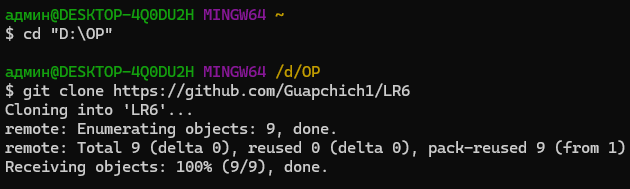

6. Добавлен файл через интерфейс GitHub. Подтянуты изменения в
локальный репозиторий.

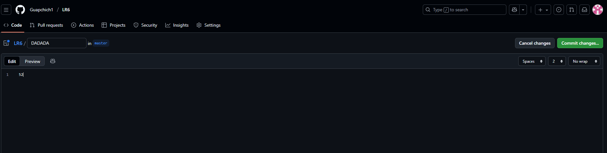
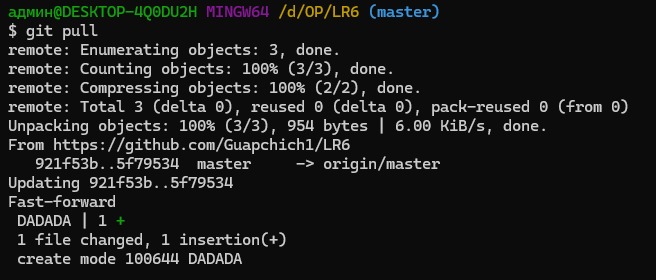

7. Получена история операций для каждой из веток.

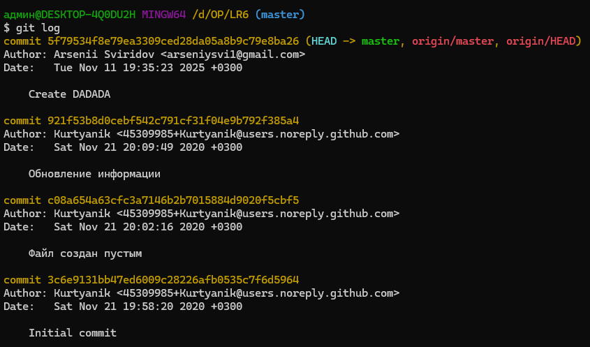

8. Просмотрены последние изменения.

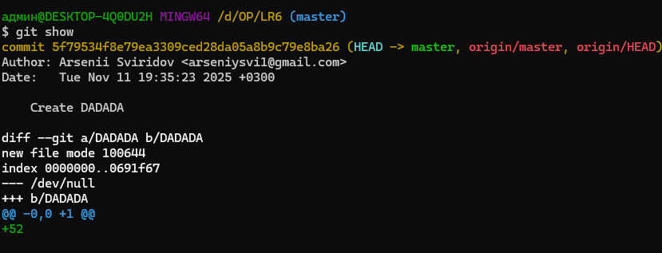

9. Выполнено слияние в ветку master, разрешён конфликт.

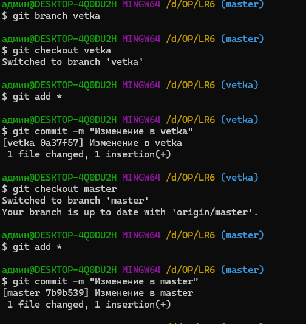

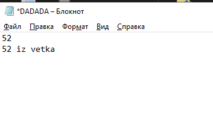

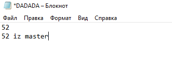

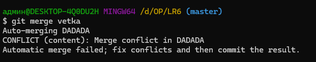

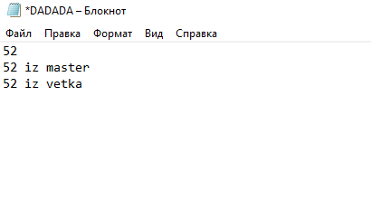

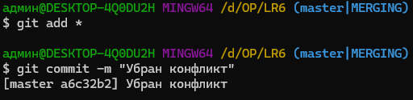

10. Удалена побочная ветка после успешного слияния.

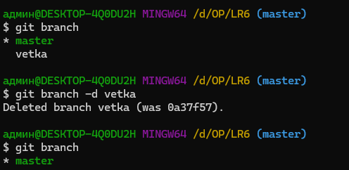

11. Сделаны и зафиксированы изменения, оставлены комментарии.

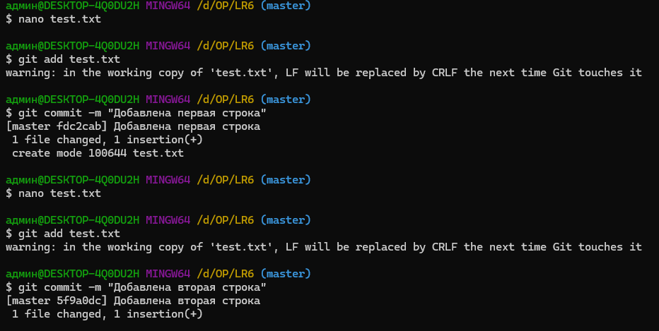
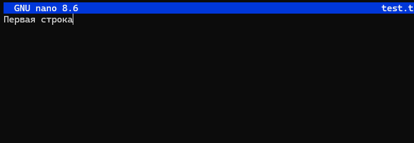
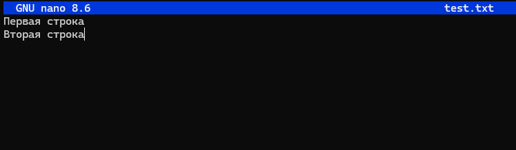
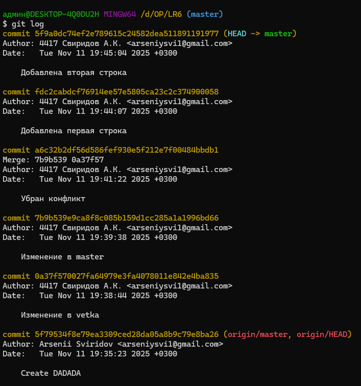

12. Сделан откат коммита.

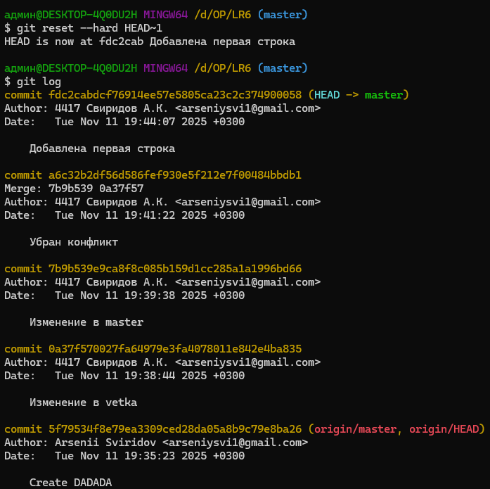

13. Создана ветка для отчёта.

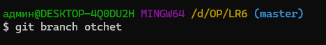

14. Получена история операций в форматированном виде

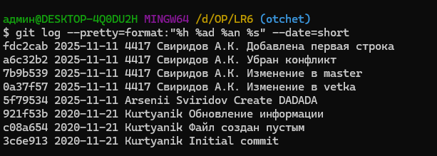

## Лог команд

	git clone
	git add
	git commit -m
	git push
	git show
	git branch
	git checkout
	git log
	git merge
	git branch -d
	git revert HEAD
	git push
	git log --pretty=format:"%h %ad %an %s" --date=short
	git config --global user.name
	git config --global user.email

## Вывод

В ходе лабораторной работы были изучены базовые возможности системы управления версиями, получен опыт работы с Git Api и локальным и удаленным репозиториями, 
также был получен опыт работы с Markdown.
